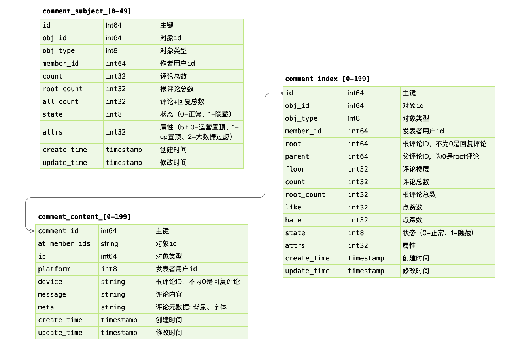

学习笔记

可用性设计

### 隔离
对系统或资源进行隔离，可以降低故障时的影响、传播范围。
- 动静隔离
  
    动态和静态进行隔离。
  
    例子:
    
    1. 在数据库设计中，将大表进行动静拆分，长时间不动（内容）和改变（统计、索引等）的分离，
        
        
       
        content表属于非一致性表，即可以优先于事务先执行。即便是后续的事务失败了，内容存储也不会影响系统。
        （将耗时的操作放在事务之外）
        
        1. content表中直接使用comment_id作为主键，可以减少一次二级索引查找。
        
        2. 索引和内容分离，MySQL DataPage可以缓存

    2. 